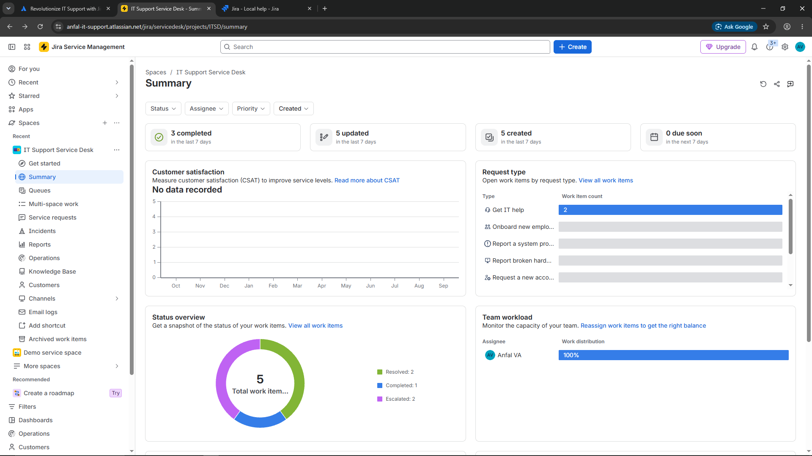
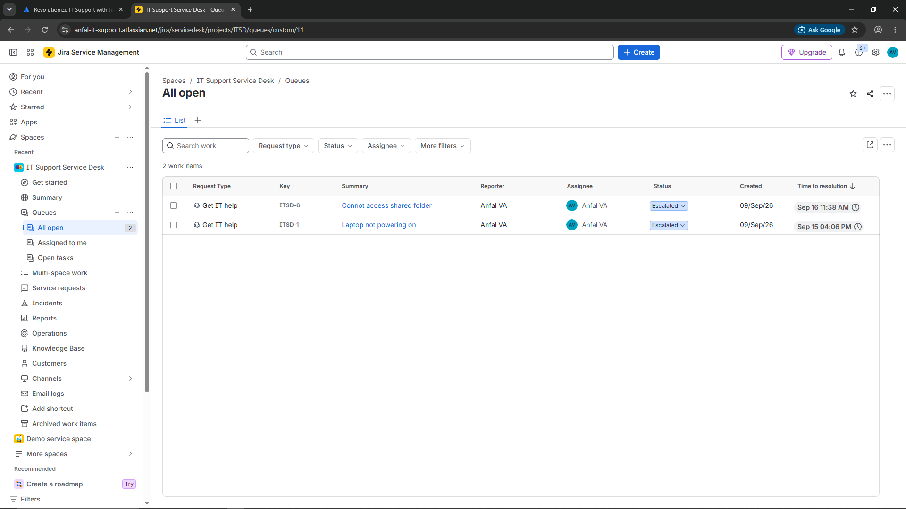
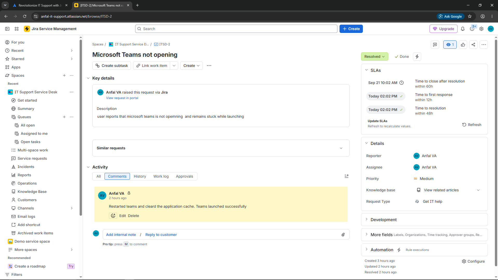
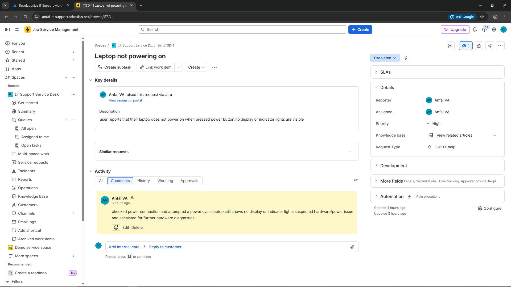

# IT Support Ticketing Lab — Jira Service Management

A small Jira Service Management lab created to simulate an L1 Desktop Support environment.

## Project Overview

Created and managed IT support incidents involving common hardware, software, network, Windows account, and access issues.

The project focuses on the basic support workflow:

Ticket → Prioritize → Assign → Troubleshoot → Document → Resolve or Escalate

## Incidents Covered

| Issue | Outcome |
|---|---|
| Laptop not powering on | Escalated |
| Microsoft Teams not opening | Resolved |
| Unable to connect to office Wi-Fi | Resolved |
| Unable to sign in to Windows account | Resolved |
| Cannot access shared folder | Escalated |

## Skills Practiced

- Jira Service Management
- Incident Management
- Ticket Prioritization
- L1 Desktop Support
- Troubleshooting Documentation
- Incident Resolution
- Escalation
- SLA Awareness

## Screenshots

### Service Desk Overview

### Support Queue

### Resolved Ticket

### Escalated Ticket

